# RAG Chatbot Implementation Plan - Main Overview

### ⚡ Quick Start (Batch Scripts)
For convenience, the system is started using two main batch files:

1. **`backend.bat`**:
   - Manages the Python **Virtual Environment (venv)**.
   - Installs/Updates `requirements.txt`.
   - Starts the FastAPI server on port 8000.
2. **`frontend.bat`**:
   - Ensures `node_modules` are installed.
   - Starts the Vite dev server on port 3000.

## 🎯 Project Goal

Transform the existing Cosmic AI chatbot into a full-featured RAG (Retrieval Augmented Generation) system that:
- [x] Accepts document uploads for analysis
- [x] **Automatic Document Preview**: Shows document content automatically in the list once uploaded (no clicks needed)
- [x] **TOON Optimization**: Uses Token-Oriented Object Notation to reduce AI input tokens by 30-60%
- [x] Uses **recursive text chunking** to process documents intelligently
- Stores embeddings in a vector database with **HNSW indexing** for fast similarity search
- Retrieves relevant context to answer user questions based on uploaded documents
- **Last-Upload Persistence**: Keeps the original PDF/File of the most recent upload for high-fidelity preview; older files are automatically cleared to save space.
- **Premium Visual Excellence**: Enhanced with glassmorphism, glowing borders, and high-quality cosmic animations to ensure a "cool," state-of-the-art feel
- Maintains the beautiful cosmic theme of the existing frontend

---

## 📋 Current Project State

### Frontend (Port 3000)
- **Location**: `c:\Users\aryan\OneDrive\Desktop\Simple_ChatBot\Frontend\cosmic-chat-ai-main\cosmic-chat-ai-main`
- **Tech Stack- **Frontend**: Vite + React + TypeScript + TailwindCSS
- **Backend Setup**: Automatic system startup using `.bat` scripts and Python `venv`
- **Environment**: All configuration via `.env` files
  - React Query for API calls
  - Cosmic-themed UI with glassmorphism
- **Current State**: Simulated chat responses (no backend integration)
- **Key Components**:
  - `ChatContainer.tsx` - Main chat interface
  - `ChatInput.tsx` - Message input with cosmic styling
  - `ChatMessage.tsx` - Message display
  - `CosmicBackground.tsx` - Animated background

### Backend (Port 8000)
- **Location**: `c:\Users\aryan\OneDrive\Desktop\Simple_ChatBot\Backend`
- **Current State**: Only has `.env` file with Azure OpenAI credentials
- **Credentials Available**:
  - `AZURE_OPENAI_API_KEY` ✅
  - `AZURE_OPENAI_API_BASE` ✅
  - `AZURE_OPENAI_DEPLOYMENT_NAME=gpt-5-chat` ✅
  - `AZURE_OPENAI_API_VERSION=2024-02-01` ✅

---

## 🏗️ Architecture Overview

```mermaid
graph TB
    subgraph "Frontend (Port 3000)"
        A[Upload Document UI] --> B[Chat Interface]
        B --> C[Document Analysis Button]
        C --> D[API Client]
    end
    
    subgraph "Backend (Port 8000 - FastAPI)"
        E[Upload Endpoint] --> F[Recursive Text Chunker]
        F --> G[Azure OpenAI Embeddings]
        G --> H[Vector DB with HNSW]
        
        I[Chat Endpoint] --> J[Query Embedding]
        J --> K[HNSW Similarity Search]
        K --> L[Context Retrieval]
        L --> M[Azure OpenAI GPT-5]
        M --> N[Streaming Response]
    end
    
    D --> E
    D --> I
    N --> B
```



---

## 🔑 Core Requirements

### 1. Document Processing Flow
1. User uploads document(s) via frontend
2. Backend receives document
3. **Recursive text chunking** breaks document into semantic chunks
4. Each chunk is embedded using Azure OpenAI embeddings API
5. Embeddings stored in vector database with **HNSW index**
6. Success confirmation sent to frontend

### 2. Chat Query Flow
1. User asks question in chat
2. Question is embedded using Azure OpenAI embeddings API
3. **HNSW similarity search** retrieves top-k relevant chunks
4. Chunks are used as context for Azure OpenAI GPT-5 chat
5. **Hybrid History Management**:
   - **Far Chat**: Summarized into a concise recap.
   - **Near Chat**: Last 5 turns preserved exactly.
6. **Guardrails** (system prompt) ensure AI only answers from document data
7. Response streams back to frontend with cosmic animations

### 3. Technology Choices

#### Vector Database Options (Python-compatible with HNSW):
- **Option 1: FAISS** (Recommended for local deployment)
  - Pros: Fast, battle-tested, supports HNSW, easy Python integration
  - Cons: No built-in persistence (need manual save/load)
  
- **Option 2: Qdrant** (Recommended for production)
  - Pros: Built-in HNSW, REST API, persistence, filtering, Python client
  - Cons: Requires separate service (Docker or cloud)
  
- **Option 3: Chroma** (Good for prototyping)
  - Pros: Simple Python API, HNSW support, persistence
  - Cons: Limited scalability for large datasets

**Recommendation**: Start with **FAISS** for development (lightweight, no external dependencies), with architecture allowing easy migration to Qdrant for production.

#### Text Chunking Strategy:
- **Recursive Character Text Splitter** from LangChain
- Hierarchy: `\n\n` → `\n` → `. ` → ` `
- Chunk size: 500-800 tokens
- Chunk overlap: 100-150 tokens (preserve context)

---

## 📁 Implementation Plan Structure

This main plan is broken down into **5 detailed sub-plans** stored in the `Plan_Md` folder:

1. **`01_Backend_Architecture.md`**
   - FastAPI setup and structure
   - Endpoint definitions
   - Error handling and validation
   - CORS configuration

2. **`02_Vector_Database_Setup.md`**
   - FAISS integration
   - HNSW index configuration
   - Embedding storage and retrieval
   - Persistence strategy

3. **`03_Document_Processing.md`**
   - Recursive text chunking implementation
   - Azure OpenAI embeddings integration
   - Document format support (PDF, TXT, DOCX)
   - Batch processing optimization

4. **`04_Frontend_Integration.md`**
   - Document upload component
   - Analyze button integration
   - API client setup with React Query
   - Streaming response handling
   - Error states and loading indicators

5. **`05_Testing_Verification.md`**
   - API endpoint testing
   - Azure OpenAI credential validation
   - Vector search accuracy testing
   - End-to-end user flow testing
   - Performance benchmarks

---

## 🔐 Environment Configuration

### Backend `.env` (Already exists with Azure credentials)
```env
# Azure OpenAI (Already configured)
AZURE_OPENAI_API_KEY=<existing_key>
AZURE_OPENAI_API_BASE=<existing_base>
AZURE_OPENAI_DEPLOYMENT_NAME=gpt-5-chat
AZURE_OPENAI_API_VERSION=2024-02-01

# Additional required variables
AZURE_OPENAI_EMBEDDING_DEPLOYMENT=text-embedding-ada-002
VECTOR_DB_PATH=./vector_store
UPLOAD_DIR=./uploads
CORS_ORIGINS=http://localhost:3000
```

### Frontend `.env` (To be created)
```env
VITE_API_BASE_URL=http://localhost:8000
VITE_MAX_FILE_SIZE=10485760
VITE_ALLOWED_FILE_TYPES=.pdf,.txt,.docx,.md
```

---

## 📦 Key Dependencies

### Backend (Python)
```
fastapi==0.115.0
uvicorn[standard]==0.32.0
python-multipart==0.0.12
python-dotenv==1.0.1
openai==1.55.0
faiss-cpu==1.9.0
langchain==0.3.13
langchain-openai==0.2.15
langchain-community==0.3.13
pypdf2==3.0.1
python-docx==1.1.2
pydantic==2.10.3
pydantic-settings==2.6.1
```

### Frontend (Already installed)
- No new dependencies needed
- Will use existing React Query for API calls
- Existing shadcn/ui components for file upload

---

## ✅ Success Criteria

1. **Document Upload**: User can upload PDF/TXT/DOCX files
2. **Analysis**: "Analyze" button triggers document processing with progress indicator
3. **Chunking**: Documents are recursively chunked maintaining semantic coherence
4. **Embeddings**: All chunks are embedded using Azure OpenAI `text-embedding-ada-002`
5. **LLM**: Azure OpenAI `gpt-5-chat`
6. **Input Format**: **TOON (Token-Oriented Object Notation)** for specialized, token-efficient prompting
7. **HNSW Search**: Vector similarity search returns relevant chunks in <100ms
8. **Hybrid Memory**: System successfully summarizes long history while keeping direct context of recent 5 turns.
9. **Context Retrieval**: Chat queries retrieve top-3 most relevant chunks
10. **RAG Response**: GPT-5 responses use retrieved context accurately
11. **Streaming**: Responses stream to frontend with cosmic animations
12. **Automatic Preview**: Document content is automatically rendered inline or in an adjacent pane upon successful upload.
13. **CORS**: Frontend and backend communicate without CORS issues
14. **Credentials**: Azure OpenAI credentials work correctly from environment

---

## 🚀 Implementation Order

1. ✅ **Research Phase** (Completed)
2. ⏳ **Backend Foundation** (Next)
   - FastAPI setup
   - CORS configuration
   - Azure OpenAI connection test
3. ⏳ **Vector Database Setup**
   - FAISS integration
   - HNSW index creation
4. ⏳ **Document Processing Pipeline**
   - File upload handling
   - Recursive chunking
   - Embedding generation
5. ⏳ **Query & Retrieval**
   - Chat endpoint
   - HNSW similarity search
   - Context injection
6. ⏳ **Frontend Integration**
   - Upload UI
   - Analyze button
   - API integration
7. ⏳ **Testing & Refinement**
   - Endpoint testing
   - E2E testing
   - Performance optimization

---

## 📝 Notes

- All Azure OpenAI API calls will use `os.getenv()` - **NO hardcoded credentials**
- CORS must allow `http://localhost:3000` for frontend
- File size limit: 10MB per document
- Supported formats: PDF, TXT, DOCX, MD
- Vector DB will persist to disk for development
- HNSW parameters:
  - `M=16` (connections per layer)
  - `efConstruction=200` (construction time)
  - `efSearch=50` (search time accuracy)

---

## 🔗 Related Plans

- Detailed backend architecture → `01_Backend_Architecture.md`
- Vector database configuration → `02_Vector_Database_Setup.md`
- Document processing pipeline → `03_Document_Processing.md`
- Frontend modifications → `04_Frontend_Integration.md`
- Testing procedures → `05_Testing_Verification.md`
