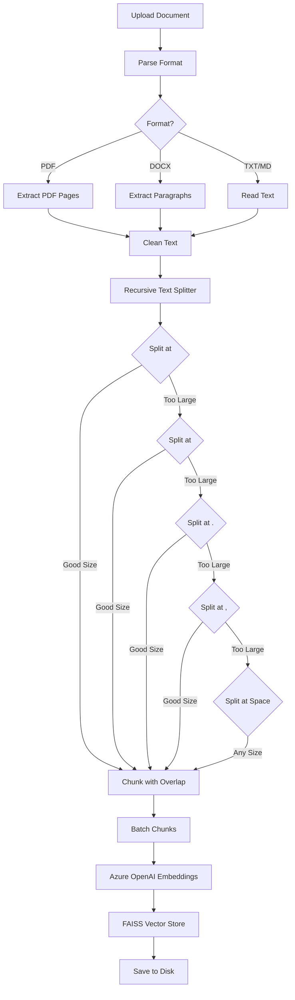

# Document Processing Pipeline - Chunking & Embedding

## 📋 Overview

This plan details the complete document processing pipeline:
1. File parsing (PDF, DOCX, TXT, MD)
2. **Recursive text chunking** with semantic boundaries
3. **Azure OpenAI embeddings** generation
4. Storage in FAISS vector database

---

## 🎯 Goals

1. Support multiple document formats
2. Implement recursive text chunking that preserves semantic coherence
3. Generate embeddings using Azure OpenAI text-embedding-ada-002
4. Handle large documents with batch processing
5. Provide progress tracking for long-running operations
6. Handle errors gracefully

---

## 📄 Document Format Support

### Supported Formats

| Format | Extension | Library | Notes |
|--------|-----------|---------|-------|
| Plain Text | `.txt`, `.md` | Built-in | Direct read |
| PDF | `.pdf` | PyPDF2 | Extract text from all pages |
| Word | `.docx` | python-docx | Read paragraphs |

### File Size Limits
- Maximum: 10MB per file
- Recommended: <5MB for optimal performance
- Large files processed in chunks to avoid memory issues

---

## 🔪 Recursive Text Chunking Strategy

### Chunking Algorithm

Uses **LangChain's RecursiveCharacterTextSplitter** with hierarchical separators:

```
Priority 1: Double newline (\n\n) - paragraph boundaries
Priority 2: Single newline (\n)   - line breaks
Priority 3: Period + space (. )   - sentence boundaries
Priority 4: Comma + space (, )    - phrase boundaries
Priority 5: Space ( )              - word boundaries
Priority 6: Empty string ("")      - character level (last resort)
```

### Chunking Parameters

```python
CHUNK_SIZE = 800       # tokens (approximately 600-800 words)
CHUNK_OVERLAP = 150    # tokens overlap between chunks
# Overlap ensures context isn't lost at boundaries
```

### Why Recursive Chunking?

1. **Preserves Semantic Meaning**: Tries to split at natural boundaries (paragraphs → sentences → words)
2. **Context Preservation**: Overlap ensures related information isn't separated
3. **Optimal Embedding Quality**: Each chunk is coherent and self-contained
4. **Handles Edge Cases**: Falls back gracefully when no good split point exists

---

## 🛠️ Implementation

### 1. Document Parser (`services/document_processor.py`)

```python
import os
from typing import List, Tuple
from PyPDF2 import PdfReader
from docx import Document as DocxDocument

from utils.logger import setup_logger

logger = setup_logger()

class DocumentParser:
    """Parse various document formats into text"""
    
    @staticmethod
    def parse(file_path: str) -> str:
        """
        Parse document and extract text
        
        Returns:
            Extracted text content
        """
        _, ext = os.path.splitext(file_path)
        ext = ext.lower()
        
        if ext in ['.txt', '.md']:
            return DocumentParser._parse_text(file_path)
        elif ext == '.pdf':
            return DocumentParser._parse_pdf(file_path)
        elif ext == '.docx':
            return DocumentParser._parse_docx(file_path)
        else:
            raise ValueError(f"Unsupported file format: {ext}")
    
    @staticmethod
    def _parse_text(file_path: str) -> str:
        """Parse plain text file"""
        try:
            with open(file_path, 'r', encoding='utf-8') as f:
                return f.read()
        except UnicodeDecodeError:
            # Try with different encoding
            with open(file_path, 'r', encoding='latin-1') as f:
                return f.read()
    
    @staticmethod
    def _parse_pdf(file_path: str) -> str:
        """Parse PDF file"""
        logger.info(f"Parsing PDF: {file_path}")
        
        reader = PdfReader(file_path)
        text_parts = []
        
        for page_num, page in enumerate(reader.pages):
            text = page.extract_text()
            if text.strip():
                text_parts.append(text)
                logger.debug(f"Extracted {len(text)} chars from page {page_num + 1}")
        
        full_text = "\n\n".join(text_parts)
        logger.info(f"PDF parsed: {len(reader.pages)} pages, {len(full_text)} chars")
        
        return full_text
    
    @staticmethod
    def _parse_docx(file_path: str) -> str:
        """Parse DOCX file"""
        logger.info(f"Parsing DOCX: {file_path}")
        
        doc = DocxDocument(file_path)
        paragraphs = []
        
        for para in doc.paragraphs:
            text = para.text.strip()
            if text:
                paragraphs.append(text)
        
        full_text = "\n\n".join(paragraphs)
        logger.info(f"DOCX parsed: {len(paragraphs)} paragraphs, {len(full_text)} chars")
        
        return full_text
```

### 2. Recursive Text Chunker (`services/chunking.py`)

```python
from langchain.text_splitter import RecursiveCharacterTextSplitter
from typing import List
from config.settings import settings
from utils.logger import setup_logger

logger = setup_logger()

class TextChunker:
    """Recursive text chunking with semantic boundaries"""
    
    def __init__(self):
        # Approximate tokens per character (rough estimate)
        # OpenAI uses ~4 chars per token on average
        chunk_size_chars = settings.CHUNK_SIZE * 4
        chunk_overlap_chars = settings.CHUNK_OVERLAP * 4
        
        self.splitter = RecursiveCharacterTextSplitter(
            chunk_size=chunk_size_chars,
            chunk_overlap=chunk_overlap_chars,
            length_function=len,
            separators=[
                "\n\n",  # Paragraph
                "\n",    # Line
                ". ",    # Sentence
                ", ",    # Phrase
                " ",     # Word
                ""       # Character (last resort)
            ],
            keep_separator=True
        )
    
    def chunk_text(self, text: str) -> List[str]:
        """
        Split text into semantic chunks
        
        Args:
            text: Input text to chunk
            
        Returns:
            List of text chunks
        """
        if not text or not text.strip():
            logger.warning("Empty text provided for chunking")
            return []
        
        chunks = self.splitter.split_text(text)
        
        # Post-process chunks
        processed_chunks = []
        for i, chunk in enumerate(chunks):
            # Remove excessive whitespace
            chunk = " ".join(chunk.split())
            
            # Skip very small chunks (less than 50 chars)
            if len(chunk) < 50:
                logger.debug(f"Skipping small chunk {i}: {len(chunk)} chars")
                continue
            
            processed_chunks.append(chunk)
        
        logger.info(f"Text chunked: {len(text)} chars → {len(processed_chunks)} chunks")
        
        return processed_chunks

# Global chunker instance
_text_chunker = None

def get_text_chunker() -> TextChunker:
    """Get or create text chunker singleton"""
    global _text_chunker
    if _text_chunker is None:
        _text_chunker = TextChunker()
    return _text_chunker
```

### 3. Azure OpenAI Embeddings Service (`services/embeddings.py`)

```python
import os
import numpy as np
from typing import List
from openai import AzureOpenAI
from config.settings import settings
from utils.logger import setup_logger

logger = setup_logger()

class EmbeddingService:
    """Azure OpenAI embedding generation"""
    
    def __init__(self):
        self.client = AzureOpenAI(
            api_key=os.getenv("AZURE_OPENAI_API_KEY"),
            api_version=settings.AZURE_OPENAI_API_VERSION,
            azure_endpoint=os.getenv("AZURE_OPENAI_API_BASE")
        )
        self.deployment = settings.AZURE_OPENAI_EMBEDDING_DEPLOYMENT
        self.dimension = 1536  # text-embedding-ada-002 dimension
    
    def embed_texts(self, texts: List[str]) -> np.ndarray:
        """
        Generate embeddings for multiple texts
        
        Args:
            texts: List of text strings to embed
            
        Returns:
            NumPy array of shape (len(texts), 1536)
        """
        if not texts:
            return np.array([])
        
        try:
            # Azure OpenAI supports batch embedding
            response = self.client.embeddings.create(
                input=texts,
                model=self.deployment
            )
            
            # Extract embeddings
            embeddings = [item.embedding for item in response.data]
            embeddings_array = np.array(embeddings, dtype=np.float32)
            
            logger.info(f"Generated {len(embeddings)} embeddings")
            
            return embeddings_array
            
        except Exception as e:
            logger.error(f"Error generating embeddings: {e}")
            raise
    
    def embed_query(self, query: str) -> np.ndarray:
        """
        Generate embedding for a single query
        
        Args:
            query: Query text
            
        Returns:
            NumPy array of shape (1536,)
        """
        embeddings = self.embed_texts([query])
        return embeddings[0] if len(embeddings) > 0 else np.array([])

# Global embedding service instance
_embedding_service = None

def get_embedding_service() -> EmbeddingService:
    """Get or create embedding service singleton"""
    global _embedding_service
    if _embedding_service is None:
        _embedding_service = EmbeddingService()
    return _embedding_service

async def test_azure_connection() -> bool:
    """Test Azure OpenAI connection"""
    try:
        service = get_embedding_service()
        test_embedding = service.embed_query("test")
        return len(test_embedding) == 1536
    except Exception as e:
        logger.error(f"Azure OpenAI connection test failed: {e}")
        return False
```

### 4. Document Processing Orchestrator (`services/document_processor.py` - continuation)

```python
from services.chunking import get_text_chunker
from services.embeddings import get_embedding_service
from services.vector_store import get_vector_store
from utils.logger import setup_logger

logger = setup_logger()

async def process_document(file_path: str, file_id: str):
    """
    Complete document processing pipeline
    
    Steps:
    1. Parse document
    2. Chunk text recursively
    3. Generate embeddings
    4. Store in vector database
    """
    try:
        # 1. Parse document
        logger.info(f"Processing document: {file_path}")
        parser = DocumentParser()
        text = parser.parse(file_path)
        logger.info(f"Extracted text: {len(text)} characters")
        
        # 2. Chunk text
        chunker = get_text_chunker()
        chunks = chunker.chunk_text(text)
        
        if not chunks:
            logger.warning(f"No chunks generated for {file_id}")
            return
        
        logger.info(f"Generated {len(chunks)} chunks")
        
        # 3. Generate embeddings (batch processing)
        embedding_service = get_embedding_service()
        
        # Process in batches to avoid token limits
        BATCH_SIZE = 16  # Azure OpenAI batch limit
        all_embeddings = []
        
        for i in range(0, len(chunks), BATCH_SIZE):
            batch = chunks[i:i+BATCH_SIZE]
            logger.info(f"Embedding batch {i//BATCH_SIZE + 1}/{(len(chunks)-1)//BATCH_SIZE + 1}")
            
            batch_embeddings = embedding_service.embed_texts(batch)
            all_embeddings.append(batch_embeddings)
        
        # Concatenate all embeddings
        import numpy as np
        embeddings = np.vstack(all_embeddings)
        
        logger.info(f"Generated embeddings: shape {embeddings.shape}")
        
        # 4. Store in vector database
        vector_store = get_vector_store()
        filename = os.path.basename(file_path)
        
        vector_store.add_chunks(
            file_id=file_id,
            filename=filename,
            chunks=chunks,
            embeddings=embeddings
        )
        
        logger.info(f"✅ Document processed successfully: {file_id}")
        
        # Original file is KEPT for high-fidelity preview
        # It will be cleared by the next upload's save_upload_file() call.
        
    except Exception as e:
        logger.error(f"Error processing document {file_id}: {e}")
        raise
```

---

## 📊 Processing Flow Diagram



---

## 🧪 Testing

### Test Document Processing

```python
# test_document_processing.py
import asyncio
from services.document_processor import process_document

async def test_processing():
    # Create test file
    with open("test_doc.txt", "w") as f:
        f.write("""
        This is a test document with multiple paragraphs.
        
        The recursive chunker should split this intelligently.
        Each paragraph will be considered for chunking.
        
        This is another paragraph.
        It contains multiple sentences. Each sentence adds context.
        The chunker will try to keep paragraphs together.
        
        But if a paragraph is too long, it will split at sentence boundaries.
        This ensures semantic coherence in each chunk.
        """ * 50)  # Repeat to create larger document
    
    # Process
    await process_document("test_doc.txt", "test-id-123")
    
    # Verify
    from services.vector_store import get_vector_store
    vs = get_vector_store()
    status = vs.get_document_status("test-id-123")
    print(f"Processing status: {status}")
    
    # Search test
    from services.embeddings import get_embedding_service
    emb_service = get_embedding_service()
    query_emb = emb_service.embed_query("test document")
    results = vs.search(query_emb, top_k=3, file_ids=["test-id-123"])
    
    print(f"\nTop {len(results)} results:")
    for r in results:
        print(f"  Score: {r['score']:.3f}")
        print(f"  Content: {r['content'][:100]}...")

if __name__ == "__main__":
    asyncio.run(test_processing())
```

---

## 📦 Dependencies

Add to `requirements.txt`:

```
# Document Processing
pypdf2==3.0.1
python-docx==1.1.2

# Text Chunking
langchain==0.3.13
langchain-openai==0.2.15
langchain-community==0.3.13

# Azure OpenAI
openai==1.55.0
```

---

## ⚡ Performance Optimization

### Batch Processing
- Process embeddings in batches of 16 (Azure limit: 2048, but 16 is safer)
- Reduces API calls and improves throughput

### Async Processing
- Use `BackgroundTasks` in FastAPI for non-blocking processing
- Return immediately with "processing" status
- Client polls for completion

### Caching (Optional Future Enhancement)
```python
# Cache embeddings for frequently queried chunks
from functools import lru_cache

@lru_cache(maxsize=1000)
def cached_embed(text: str):
    return embedding_service.embed_query(text)
```

---

## 🚨 Error Handling

### Common Errors and Solutions

| Error | Cause | Solution |
|-------|-------|----------|
| `UnicodeDecodeError` | Wrong encoding | Try latin-1 fallback |
| `RateLimitError` | Too many API calls | Add retry with exponential backoff |
| `InvalidRequestError` | Token limit exceeded | Validate chunk size before embedding |
| `FileNotFoundError` | Missing upload | Verify file exists before processing |

### Retry Logic for Azure OpenAI

```python
from tenacity import retry, stop_after_attempt, wait_exponential

@retry(
    stop=stop_after_attempt(3),
    wait=wait_exponential(multiplier=1, min=2, max=10)
)
def embed_with_retry(texts: List[str]):
    return embedding_service.embed_texts(texts)
```

---

## ✅ Verification Checklist

- [ ] Test parsing PDF files
- [ ] Test parsing DOCX files
- [ ] Test parsing TXT/MD files  - [ ] Verify recursive chunking produces semantic chunks
- [ ] Verify chunk overlap is working
- [ ] Test embedding generation with Azure OpenAI
- [ ] Verify embeddings are 1536-dimensional
- [ ] Test batch processing for large documents
- [ ] Verify chunks stored in vector database
- [ ] Test document status endpoint
- [ ] Test end-to-end pipeline

---

## 📌 Next Steps

1. Integrate document processing in upload endpoint
2. Implement chat service with RAG → Main overview
3. Frontend integration → `04_Frontend_Integration.md`
4. End-to-end testing → `05_Testing_Verification.md`
